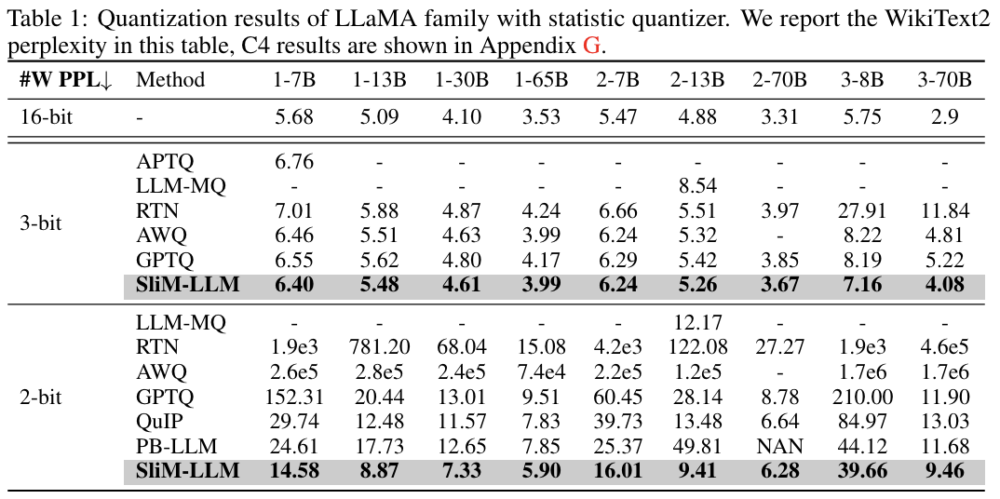

# SliM-LLM: Salience-Driven Mixed-Precision Quantization for Large Language Models


[](https://arxiv.org/abs/2405.14917)


The current release supports:
- SliM-LLM for accurate weight-only quantization (`W=2bit`/`W=3bit`).
- Support pre-trained model for LLMs (`LLaMA-1&2&3`/`OPT`).
- SliM-LLM is built on GPTQ and SliM-LLM+ is built on Omniquant, respectively.
- Experimental mixed-precision deployment on AutoGPTQ for LLaMA-7b/LLaMA-13b/LLaMA-2-7b.


## News
- [2024/5] 🌟 Our SliM-LLM paper and code are open now


## Contents
- [Install](#install)
- [SliM-LLM Mixed-precision Zoo](#SliM-LLM Mixed-Precision Zoo)
- [Usage](#usage)
- [Results](#results)
- [Citation](#citation)

## Install
```
conda create -n slimllm python=3.10 -y
conda activate slimllm
git clone https://github.com/Aaronhuang-778/SliM-LLM
cd SliM-LLM
pip install --upgrade pip 
pip install -r requirement.txt
```

We also provide the fixed-AutoGPTQ which supports mixed-precision packing and computing in `./AutoGPTQ`. Please download the needed package if using real quantization:
```
cd AutoGPTQ
pip install -r requirement.txt
```


## SliM-LLM Mixed-Precision Zoo
We provide the generated group-wise bit-width for each model

You can download the pre-trained SliM-LLM mixed-precision you need at [Huggingface](https://huggingface.co/AaronHuangWei/SliM-LLM_group-precision/tree/main).

We currently provide mixed-precision results for some models, and the remaining results are still being uploaded (SliM-LLM and SliM-LLM+ use the same set of group-wise mixed-precision).


## Usage

**Full running scripts of SliM-LLM and SliM-LLM+ are provided in each `./scripts/`**. 

Here, We provide the running example of SliM-LLM and SliM-LLM+

1. For efficient quantization of SliM-LLM, you can obtain the group-wise bit-width from:
```
# Please run this script in ./SliM-LLM
conda install git git-lfs
git lfs install
git clone https://huggingface.co/AaronHuangWei/SliM-LLM_group-precision
```

If you want to download the group bit-width in other paths. Please check  ` ./SliM-LLM/slim-llm/run.py (360 line)` and ` ./SliM-LLM/slim-llm-plus/main.py (324 line)`.

2. Mixed-precision quantization with SliM-LLM

   Without pre-download group bit-width, SliM-LLM will run Salience-Determined Bit Allocation (SBA) to generate mixed-precision first.
```
cd slim-llm

# W2A16G128
python run.py \
{your top file for OPT}/facebook/opt-1.3b wikitext2 2bit --groupsize 128 \
--device "cuda:0" --tasks piqa,arc_easy,arc_challenge,boolq,hellaswag,winogrande

python run.py \
{your top file for LLaMA}/huggyllama/llama-7b wikitext2 2bit --groupsize 128 \
--device "cuda:0" --tasks piqa,arc_easy,arc_challenge,boolq,hellaswag,winogrande

python run.py \
{your top file for LLaMA-2}/llama2/Llama-2-7b-hf wikitext2 2bit --groupsize 128 \
--device "cuda:0" --tasks piqa,arc_easy,arc_challenge,boolq,hellaswag,winogrande

# W3A16G128
python run.py \
{your top file for OPT}/facebook/opt-1.3b wikitext2 3bit --groupsize 128 \
--device "cuda:0" --tasks piqa,arc_easy,arc_challenge,boolq,hellaswag,winogrande

python run.py \
{your top file for LLaMA}/huggyllama/llama-7b wikitext2 3bit --groupsize 128 \
--device "cuda:0" --tasks piqa,arc_easy,arc_challenge,boolq,hellaswag,winogrande

python run.py \
{your top file for LLaMA-2}/llama2/Llama-2-7b-hf wikitext2 3bit --groupsize 128 \
--device "cuda:0" --tasks piqa,arc_easy,arc_challenge,boolq,hellaswag,winogrande
```

3. For packing the quantization results with mixed-precision format: Example on LLaMA-13B


```
#First export the autogptq with mixed-precision version into python environment
bash:
export $PYTHONPATH=$PYTHONPATH:/path/to/AutoGPTQ

#Then run the SliM-LLM script for LLaMA-13B

python run.py \
 huggyllama/llama-13b wikitext2 2bit --groupsize 128 \
--device "cuda:0" --tasks piqa,arc_easy,arc_challenge,boolq,hellaswag,winogrande 、
--save --pack

python run.py \
 huggyllama/llama-13b wikitext2 3bit --groupsize 128 \
--device "cuda:0" --tasks piqa,arc_easy,arc_challenge,boolq,hellaswag,winogrande 、
--save --pack
```


4. Mixed-precision quantization with SliM-LLM+

   Notably, SliM-LLM+ can only be run with group-wise precision configuration. Please download the bit-width first or use SliM-LLM to generate the bit-width. 
```
cd slim-llm-plus

# W2A16G128
CUDA_VISIBLE_DEVICES=0 python main.py \
--model {your top file for OPT}/facebook/opt-1.3b --eval_ppl \
--epochs 50 --output_dir ./log/opt-1.3b-w2a16g128 \
--wbits 2 --abits 16 --group_size 128 --lwc \
--tasks piqa,arc_easy,arc_challenge,boolq,hellaswag,winogrande

CUDA_VISIBLE_DEVICES=0 python main.py \
--model {your top file for LLaMA}/huggyllama/llama-7b  --eval_ppl \
--epochs 50 --output_dir ./log/llama-7b-w2a16g128 \
--wbits 2 --abits 16 --group_size 128 --lwc --aug_loss

CUDA_VISIBLE_DEVICES=0 python main.py \
--model {your top file for LLaMA-2}/llama2/Llama-2-7b-hf  --eval_ppl \
--epochs 50 --output_dir ./log/llama-2-7b-w2a16g128 \
--wbits 2 --abits 16 --group_size 128 --lwc --aug_loss

# W3A16G128
CUDA_VISIBLE_DEVICES=0 python main.py \
--model {your top file for OPT}/facebook/opt-1.3b --eval_ppl \
--epochs 50 --output_dir ./log/opt-1.3b-w3a16g128 \
--wbits 3 --abits 16 --group_size 128 --lwc \
--tasks piqa,arc_easy,arc_challenge,boolq,hellaswag,winogrande

CUDA_VISIBLE_DEVICES=0 python main.py \
--model {your top file for LLaMA}/huggyllama/llama-7b  --eval_ppl \
--epochs 50 --output_dir ./log/llama-7b-w3a16g128 \
--wbits 3 --abits 16 --group_size 128 --lwc --aug_loss

CUDA_VISIBLE_DEVICES=0 python main.py \
--model {your top file for LLaMA-2}/llama2/Llama-2-7b-hf  --eval_ppl \
--epochs 50 --output_dir ./log/llama-2-7b-w3a16g128 \
--wbits 3 --abits 16 --group_size 128 --lwc --aug_loss
```

4. Due to the time consumption,  we provide the pretained SliM-LLM+ parameters in huggingface to reproduce evaluation results of our paper

   1\) download the pretrained SliM-LLM+ parameters you want through [Huggingface](https://huggingface.co/AaronHuangWei/SliM-LLM-plus_parameters/tree/main) (we are still uploading pretrained parameters).

   2\) set epoch as 0 and inference with resume (following Omniquant):
```
CUDA_VISIBLE_DEVICES=0 python main.py \
--model /PATH/TO/LLaMA/llama-2-7b  \
--epochs 0 --output_dir ./log/test \
--eval_ppl --wbits 2 --abits 16 --group_size 128 --lwc \
--resume /PATH/TO/Pretrained/Parameters 
```


## Results
- SliM-LLM results on the LLaMA family, compared with other gradient-free PTQ methods



- SliM-LLM+ results on the LLaMA family, compared with other gradient-optimized PTQ methods


- SliM-LLM results on zero-shot datasets


## Related Project
[OmniQuant: Omnidirectionally Calibrated Quantization for Large Language Models](https://github.com/OpenGVLab/OmniQuant)

[GPTQ: Accurate Post-training Compression for Generative Pretrained Transformers](https://github.com/IST-DASLab/gptq)

[PB-LLM: Partially Binarized Large Language Models](https://github.com/hahnyuan/PB-LLM)

[SmoothQuant: Accurate and Efficient Post-Training Quantization for Large Language Models](https://github.com/mit-han-lab/smoothquant)

[AWQ: Activation-aware Weight Quantization for LLM Compression and Acceleration](https://github.com/mit-han-lab/llm-awq)

[AutoGPTQ](https://github.com/PanQiWei/AutoGPTQ)

## Citation
If you find SliM-LLM useful for your study or research, please cite our paper with:
```
@misc{huang2024slimllm,
      title={SliM-LLM: Salience-Driven Mixed-Precision Quantization for Large Language Models}, 
      author={Wei Huang and Haotong Qin and Yangdong Liu and Yawei Li and Xianglong Liu and Luca Benini and Michele Magno and Xiaojuan Qi},
      year={2024},
      eprint={2405.14917},
      archivePrefix={arXiv},
      primaryClass={cs.LG}
}
```